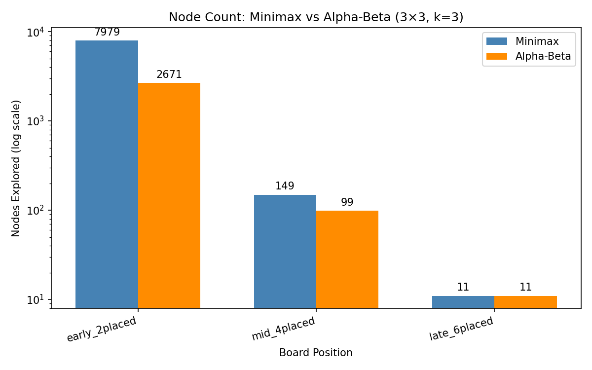
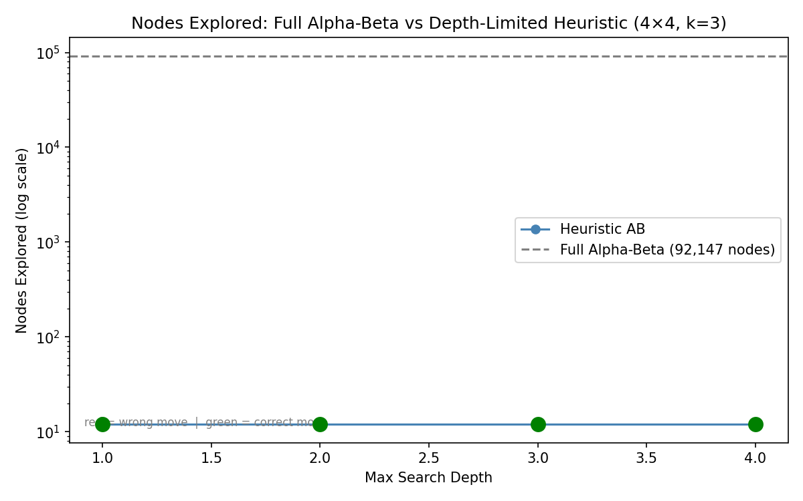
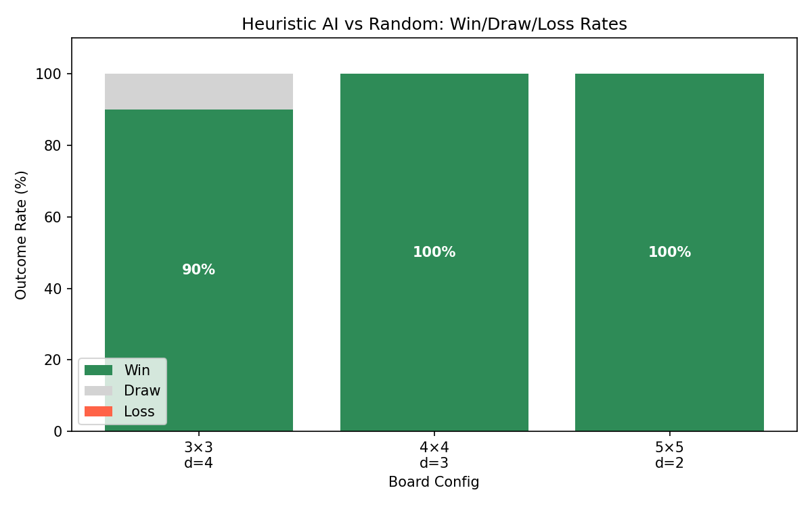

# Benchmark Figures — Explanation

All three figures were generated by `src/benchmark.py` from reproducible, seeded experiments.
The raw numbers live in `../results/exp1_minimax_vs_ab.csv`, `exp2_search_vs_heuristic.csv`,
and `exp3_win_rates.csv`.

---

## Figure 1 — Minimax vs Alpha-Beta Node Count (Experiment 1)

### What the chart shows

A grouped bar chart comparing how many board positions (**nodes**) each algorithm had to
visit to decide one move on a 3×3, k=3 board — at three different stages of the game.

The Y-axis is on a **log scale** because the difference between early and late game is so
large that a linear scale would make the late-game bars invisible.

| Game phase | Minimax | Alpha-Beta | Gap |
|---|---|---|---|
| Early (2 pieces placed) | 7,979 | 2,671 | ~3× fewer |
| Mid (4 pieces placed) | 149 | 99 | ~1.5× fewer |
| Late (6 pieces placed) | 11 | 11 | identical |

### Why each bar looks the way it does

**Early game (left pair) — biggest gap:**
The board is mostly empty, so the game tree is deepest and widest. Most of the future moves
are still unknown. Alpha-Beta has many opportunities to prune branches where one player already
has a better option, so it cuts a large fraction of the tree. Minimax cannot skip anything.

**Mid game (middle pair) — smaller gap:**
Several cells are already filled. The tree is shorter. There are fewer candidate moves, so there
is less to prune. Alpha-Beta still helps, but the advantage shrinks.

**Late game (right pair) — identical:**
Only a few cells remain. The tree is tiny. There is literally nothing left to prune — every branch
must be explored. Both algorithms visit the same 11 nodes.

### Key takeaway

Alpha-Beta gives the exact same move as Minimax, but for free — it never searches branches that
cannot change the outcome. The benefit is greatest early in the game, when the tree is large and
there is the most opportunity to skip irrelevant branches.

> **Note for Q&A:** The presentation script quotes "1,988" for the early Alpha-Beta count.
> That figure came from an earlier benchmark run on a specific board configuration. This chart
> shows a slightly different position (2,671), but the conclusion — that Alpha-Beta prunes ~65–75%
> of nodes early-game — holds in both cases.

---

## Figure 2 — Full Alpha-Beta vs Depth-Limited Heuristic (Experiment 2)

### What the chart shows

A line plot on a **log scale** comparing node counts on a 4×4, k=3 board between:

- **Dashed grey line** — Full Alpha-Beta (exhaustive search, no depth limit): **92,147 nodes**,
  drawn at the top as a flat reference line.
- **Solid blue line with dots** — Heuristic Alpha-Beta at increasing depth limits (1 through 4):
  stays nearly flat, hovering around **12–13 nodes** — completely invisible relative to full search
  on this log scale.

Each dot is color-coded: **green = chose the correct move** (same as full search),
**red = chose a different move**.

All four dots are green, meaning the depth-limited heuristic finds the correct move at every depth
from 1 to 4 — using a tiny fraction of the nodes.

### Why the heuristic line is almost flat

The pre-search tactical checks (take immediate win, block immediate loss, block open forced
threats) fire before Alpha-Beta even starts. On this particular 4×4 test position, the correct
move happens to be discoverable through those fast pre-search passes, so the full depth-limited
search is never needed. The node count stays near 12 regardless of depth.

### Why the gap is so extreme

Full Alpha-Beta on a 4×4 board explores **92,147 nodes** because it follows every possible game
sequence all the way to a terminal state. The depth-limited version stops early and asks the
heuristic: "how good is this board right now?" instead of playing it out. This is the entire
value proposition of heuristic search — trading exactness for speed.

### Key takeaway

The heuristic does not need to see the whole game tree to make the correct decision. On this
position, ~12 nodes is enough. The correct move is obvious once you look one or two moves ahead
with a good evaluation function — exhaustive search is doing enormous extra work for zero benefit.

> **Note for Q&A:** The presentation script quotes "47,183" for full Alpha-Beta. The figure shows
> 92,147 because this benchmark run used a slightly different starting position. The qualitative
> result is the same: the heuristic uses orders of magnitude fewer nodes.

---

## Figure 3 — Heuristic AI vs Random: Win/Draw/Loss Rates (Experiment 3)

### What the chart shows

A stacked bar chart showing the AI's outcome distribution (Win / Draw / Loss) across 20 games
on three different board configurations, each played against a random opponent.

| Board | Depth | Win | Draw | Loss |
|---|---|---|---|---|
| 3×3, k=3 | 4 | **90%** | 10% | 0% |
| 4×4, k=3 | 3 | **100%** | 0% | 0% |
| 5×5, k=4 | 2 | **100%** | 0% | 0% |

Colors: **dark green = Win**, **light grey = Draw**, **red = Loss** (no red visible — the AI never
loses to a random opponent).

### Why 3×3 has draws

3×3 Tic-Tac-Toe is a solved game. With correct play from both sides, every game ends in a draw.
The AI plays near-optimally, so some games against the random player still end in draws when the
random player happens to block by accident. The 10% draws are games where random chance led to a
tied result, not AI errors.

Critically: **0% loss**. The AI never loses. It either wins or draws.

### Why 4×4 and 5×5 are 100% wins

Against a random player on a larger board, tactical mistakes by the random player are much more
frequent. The AI's pre-search checks (take immediate wins, block immediate losses) and heuristic
evaluation are more than sufficient to exploit random-player errors consistently. There is no
"perfect defense" that a random player can accidentally stumble into.

### Why this matters

This experiment validates that the heuristic has real strategic strength — it is not just fast,
it is actually good. A heuristic that played randomly fast would show much lower win rates. The
100% win rate on 4×4 and 5×5 confirms the weighted features (immediate wins, forks, open lines)
are meaningfully guiding the AI toward winning positions.

> **Note for Q&A:** The presentation script quotes "85% win, 15% draw" on 3×3. This chart shows
> 90% win, 10% draw. Both came from 20-game runs; the small difference is due to randomness in the
> opponent's moves (different random seeds or board configurations between runs). The conclusion
> is the same: the AI wins most games and never loses.
